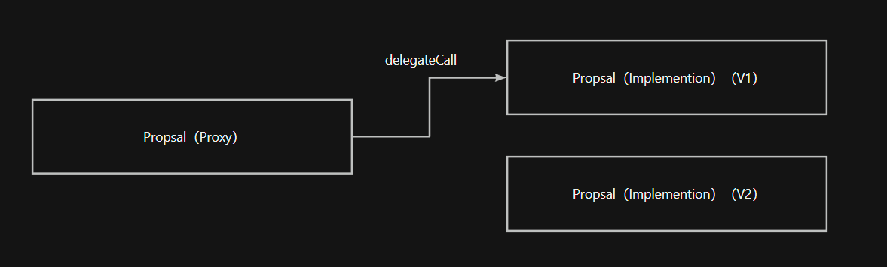

# [Local testing](https://hardhat.org/ignition/docs/getting-started#quick-start)
1. `npx hardhat node` Start the local test network and you can see that the startup is in progress（ http://127.0.0.1:8545/ ）And related test accounts.
2. `npx hardhat ignition deploy ignition/modules/index.js --network localhost` Add the local network to the browser wallet (using OKX as an example).
3. Add the local network to the browser wallet (using OKX as an example).

4. Add the test account to the browser wallet as needed for testing.

# Contract address has been deployed:
1. zksync testnet
flareTokenContract---------- 0x1fEa066B6327567088C84c759b29acD653b7660d
Implementation contract was deployed to 0xE9f416D7DDC163E3d6A4620aCe164236B54359A7
UUPS proxy was deployed to 0x5Ff86D195677e4F9E7b4d20A904d3f48F150986a
2. sepolia testnet
FlareTokenModule#FlareToken - 0x65F92002b645Be9d582BBd1D5FC9C7A51AAC9bCF
ProposalLogicModule#ProposalLogic - 0xd92B00D9D2Fc3e51828672bfA6D77D43DF35191c

# UUPS Example diagram


# Test contract
1. `npx hardhat node`
2. `npx hardhat test ${path} --network hardhat`

# Steps for deploying ZkSync test network
> `npx  hardhat deploy-zksync --script index.js --network zkSyncTestnet` （Error reporting： `Error in plugin @matterlabs/hardhat-zksync-deploy: Deploy function does not exist or exported invalidly.`，Temporarily abandoned）
1. First initialization `npx hardhat run deploy/index.js` 
> [Subsequent replacement of logical contracts](https://docs.zksync.io/build/tooling/hardhat/hardhat-zksync-upgradable.html#upgradable-examples)
2. [view contract](https://sepolia.explorer.zksync.io/)
3. [verify](https://docs.zksync.io/build/tooling/hardhat/hardhat-zksync-verify.html#commands)
`npx  hardhat verify --network zkSyncTestnet  ${Contract address}  ${Construction parameters}`


# Sample Hardhat Project
This project demonstrates a basic Hardhat use case. It comes with a sample contract, a test for that contract, and a Hardhat Ignition module that deploys that contract.

Try running some of the following tasks:

```shell
npx hardhat help
npx hardhat test
REPORT_GAS=true npx hardhat test
npx hardhat node
npx hardhat ignition deploy ./ignition/modules/Lock.js
```
