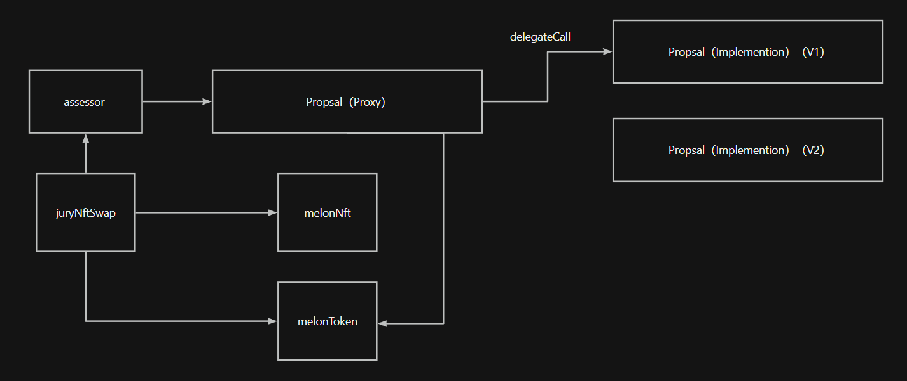

# faucets guide
1. 获取0.05 sepolia ETH  
https://www.infura.io/faucet/sepolia?_ga=2.191463465.2049402864.1717224083-318271395.1717224083
2. 通过跨链桥转化成zk test ETH  
https://app.txsync.io/bridge

# deployed info
## zksync testnet
- melonToken  
0xDf77D063Cf7BdBf2D8167B18e511c82b6cE6d1DD
- proposal  
0x519A4a28e79294d502EC3a1B590F0C64d33b2f50
- melonNft  
0xAF55f906005403D889cd5C16ef0341b5E34731C1
- jury
0x15408Ddd46C0bA4b852958D83cF1672C19d9fA7f
- juryNftSwap  
0xDeBaA3977dAB0Fb46F22AECcbBa97ee17dbf60bb
- pledge  
0x05B03AD0b08FD980eA163Ac0960AA9B717e43B8f

# Architecture diagram


# Test contract
`npx hardhat test ${path} --network hardhat`

# Steps for deploying ZkSync test network
> `npx  hardhat deploy-zksync --script index.js --network zkSyncTestnet` （Error reporting： `Error in plugin @matterlabs/hardhat-zksync-deploy: Deploy function does not exist or exported invalidly.`，Temporarily abandoned）
1. deploy  
`npx hardhat run deploy/index.js` 
2. verify  
`npx  hardhat verify --network zk_test  ${Contract address}  ${Construction parameters}`


# doc
https://docs.zksync.io/build/tooling/hardhat  
https://sepolia.explorer.zksync.io/  
https://docs.zksync.io/build/tooling/hardhat/hardhat-zksync-upgradable.html#upgradable-examples

# Sample Hardhat Project
This project demonstrates a basic Hardhat use case. It comes with a sample contract, a test for that contract, and a Hardhat Ignition module that deploys that contract.

Try running some of the following tasks:

```shell
npx hardhat help
npx hardhat test
REPORT_GAS=true npx hardhat test
npx hardhat node
npx hardhat ignition deploy ./ignition/modules/Lock.js
```
