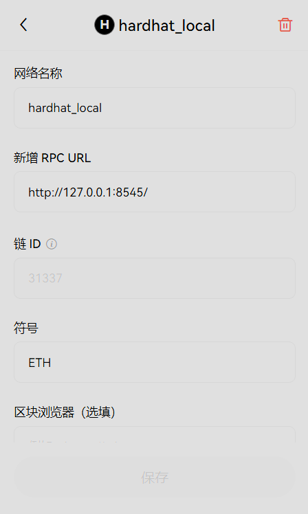

# 本地测试(https://hardhat.org/ignition/docs/getting-started#quick-start)
1. `npx hardhat node`启动本地测试网，可以看到启动在（http://127.0.0.1:8545/）和相关测试账号。
2. `npx hardhat ignition deploy ignition/modules/index.js --network localhost` 运行部署脚本，可以看到合约的地址，部署的账户默认是测试账号的第一个。
3. 在浏览器钱包中添加该本地网络（OKX为例）。

4. 根据测试需要，添加测试账户到浏览器钱包中。

# 已经部署合约地址（zkSync）：
- 代币合约： 0x76d094D4A9fd60f6df81a2779Dd4BDe5105cFCc5
- 提案合约： 0x9Bb9A24002E6826175a92A329340Fa8932F974B8

# 测试合约
1. `npx hardhat node`
2. `npx hardhat test --network hardhat`

# 部署ZkSync测试网步骤：
1. `npx  hardhat deploy-zksync --script index.js --network zkSyncTestnet`
2. 前往：https://sepolia.explorer.zksync.io/ 复制代币地址，查看合约
3. 验证（https://docs.zksync.io/build/tooling/hardhat/hardhat-zksync-verify.html#commands）
>（notes：如果要在浏览器上直接调用合约需要进行该步骤）

    1. 代币合约
        npx  hardhat verify --network zkSyncTestnet 代币地址
    2. 提案合约
        npx  hardhat verify --network zkSyncTestnet  合约地址  构造参数
# Sample Hardhat Project
This project demonstrates a basic Hardhat use case. It comes with a sample contract, a test for that contract, and a Hardhat Ignition module that deploys that contract.

Try running some of the following tasks:

```shell
npx hardhat help
npx hardhat test
REPORT_GAS=true npx hardhat test
npx hardhat node
npx hardhat ignition deploy ./ignition/modules/Lock.js
```
